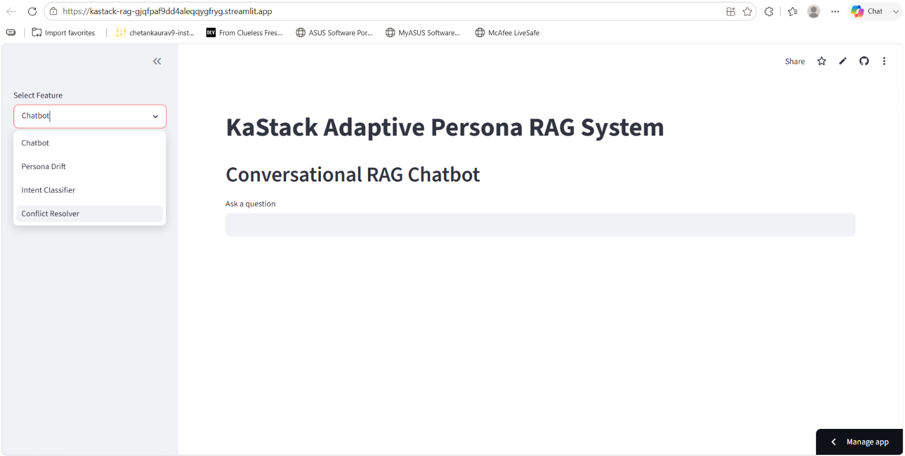

# KaStack Labs AI/ML Engineer Intern Assignment

## Persona-Aware Conversational RAG System

### Author

Chetan Kaurav

### Live Demo

https://kastack-rag-gjqfpaf9dd4aleqqygfryg.streamlit.app/

### GitHub Repository

https://github.com/CHETAN-KAURAV/KaStack-RAG

---

## Overview

This project implements a Retrieval-Augmented Generation (RAG) system for conversational data.

The system processes conversations chronologically, detects topic transitions, creates topic checkpoints, generates periodic summaries, extracts user personas, and answers queries using retrieved contextual information.

The goal was to build an end-to-end conversational memory system capable of:

- Detecting topic changes over time
- Creating topic-level summaries
- Creating 100-message checkpoints
- Extracting user personas
- Retrieving relevant context
- Answering user questions through a chatbot interface

---

# System Architecture
```
Dataset (CSV)

↓

Conversation Parsing

↓

Topic Change Detection

↓

Topic Summaries

↓

100 Message Checkpoints

↓

Persona Extraction

↓

FAISS Vector Index

↓

Retriever

↓

Chatbot

↓

Streamlit UI
```
---

# Dataset

Input Dataset:

- CSV file containing conversational data
- Each row represents one conversation
- Conversations are processed message-by-message in chronological order

Dataset Statistics:

- Total Conversations: 11,001
- Total Messages: 191,592
- Average Messages per Conversation: ~17

---

# Part 1: RAG System with Checkpoints

## Conversation Processing

Each conversation is parsed into individual messages while preserving chronological order.

Example:

User 1 → Message 1

User 2 → Message 2

User 1 → Message 3

User 2 → Message 4

This allows downstream modules to analyze topic transitions over time.

---

## Topic Change Detection

A key requirement of the assignment was to avoid treating an entire conversation as a single topic.

The system processes every conversation chronologically, message by message.

### Method

1. Messages are grouped into semantic windows.
2. Sentence embeddings are generated using Sentence Transformers (all-MiniLM-L6-v2).
3. Semantic similarity is calculated between consecutive windows.
4. If similarity drops below a predefined threshold, a topic boundary is created.
5. A new topic checkpoint is started.
6. A summary is generated only for that topic segment.

This allows a single conversation to contain multiple topic checkpoints.

### Example

Topic 1 → Messages 1–15

Discussion about moving to Portland

Topic 2 → Messages 16–27

Discussion about bookstores in Portland

Topic 3 → Messages 28–41

Discussion about reading habits

This ensures that retrieval can operate on meaningful conversation segments rather than entire conversations.

---

## Topic Detection Example


---

## Topic Summaries

For every detected topic segment:

- Topic ID
- Message Range
- Keywords
- Summary

are generated and stored.

Example:

Topic 1

Summary:

Discussion about moving to Portland and local recommendations.

Topic 2

Summary:

Discussion about bookstores and reading interests.

---

## Topic Summary Example


---

## 100 Message Checkpoints

Independent of topic segmentation, the system creates checkpoints every 100 messages.

Purpose:

- Long-term conversational memory
- Faster retrieval
- Conversation compression

Example:

Checkpoint 1

Messages 1–100

Checkpoint 2

Messages 101–200

Checkpoint 3

Messages 201–300

Each checkpoint contains a summary of its corresponding message range.

---

## Checkpoint Example


---

# Part 2: Persona Extraction

The system extracts structured persona information directly from conversation content.

No external APIs were used.

Persona extraction is performed at the conversation level.

### Occupation Extraction

Pattern matching is used to detect statements such as:

- I am a teacher
- I work as a nurse
- I am a firefighter
- I am a librarian

Detected occupations are stored in structured JSON format.

### Hobby Extraction

The system identifies activities and interests using conversational patterns such as:

- I like ...
- I love ...
- I enjoy ...
- My hobby is ...

Examples:

- Reading
- Gardening
- Hiking
- Cooking
- Music

### Personality Trait Extraction

Traits are inferred from observable conversation signals.

Examples:

- Friendly
- Curious
- Enthusiastic
- Optimistic

Trait scores are accumulated based on message patterns and conversational behavior.

### Communication Style Extraction

The following metrics are calculated:

- Average words per message
- Question ratio
- Exclamation ratio

These metrics provide insight into how a user communicates.

### Persona Output Format

Example:

```json
{
  "occupation": ["teacher"],
  "hobbies": ["reading", "gardening"],
  "traits": [
    {
      "trait": "friendly",
      "score": 8
    }
  ],
  "communication_style": {
    "avg_words": 10.4,
    "question_ratio": 0.28,
    "exclamation_ratio": 0.51
  }
}
```

---

## Persona Example


---

# Part 3: Retrieval-Augmented Generation (RAG)

## Index Construction

The following information sources are embedded and indexed:

### Topic Summaries

Generated topic-level checkpoints.

### Conversation Checkpoints

100-message summaries.

### Persona Records

Structured user persona information.

Embeddings are generated using:

Sentence Transformers (all-MiniLM-L6-v2)

and stored inside a FAISS vector index.

---

## Retrieval Workflow

The chatbot uses a Retrieval-Augmented Generation (RAG) pipeline.

### Indexed Sources

The FAISS vector database contains:

- Topic Summaries
- 100 Message Checkpoints
- Persona Records

### Retrieval Process

When a user submits a question:

1. The query is converted into an embedding.
2. FAISS performs semantic similarity search.
3. Relevant topic summaries are retrieved.
4. Relevant checkpoint summaries are retrieved.
5. Relevant persona records are retrieved.
6. Retrieved context is combined.
7. The chatbot generates an answer using the aggregated information.

Workflow:
```
User Query

↓

Query Embedding

↓

FAISS Similarity Search

↓

Retrieve Topic Summaries

↓

Retrieve Checkpoints

↓

Retrieve Persona Records

↓

Context Aggregation

↓

Answer Generation
```
This approach ensures that answers are generated using both short-term topic memory and long-term checkpoint memory.

---

# Part 4: Chatbot

A Streamlit-based chatbot interface was developed.

Supported Questions:

### Persona Questions

- What kind of person is this user?
- What are their habits?
- What hobbies do they have?
- How do they communicate?

### Context Questions

- Tell me about Portland
- Tell me about teachers
- Tell me about firefighters

The chatbot retrieves relevant context from the RAG pipeline and generates answers using the retrieved information.

---

# Round 2 Extensions

The Round 2 implementation extends the original conversational RAG system with adaptive persona modeling, offline intent classification, conflict-aware retrieval, and synchronization architecture design.

---

# Part 5: Adaptive Persona Engine

A new persona evolution module was implemented to track how user behavior changes across conversations over time.

Rather than generating a single static persona, the system maintains a timeline of personality and communication changes.

## Objective

Detect:

- Mood changes
- Tone changes
- Behavioral drift
- Triggering topics or events

---

## Persona Drift Detection

Each conversation is analyzed using:

- Extracted personality traits
- Communication style statistics
- Question frequency
- Exclamation frequency
- Average message length

From these signals the system generates:

- Mood
- Tone
- Trigger

for every conversation.

Example:

Day 1

Mood: Enthusiastic

Tone: Casual

Trigger: Powell Books

Day 4

Mood: Enthusiastic

Tone: Casual

Trigger: Everglades

Day 10

Mood: Enthusiastic

Tone: Casual

Trigger: Lasagna

---

## Drift Timeline

The output is stored in:

```
drift/drift_timeline.json
```
Example:
```
{
  "day": 10,
  "mood": "enthusiastic",
  "tone": "casual",
  "trigger": "lasagna"
}
```
---
## Drift Event Detection

The system compares adjacent timeline entries.

Whenever a meaningful change in:

- mood
- tone

is detected, a drift event is recorded.

Output:
```
drift/drift_events.json
```
This provides a historical view of how user behavior evolves over time.

---

# Part 6: Offline Intent Classifier

The system includes a fully offline intent classification module.

No external APIs are used.

---

## Supported Intents

The classifier predicts:

- reminder
- emotional-support
- action-item
- small-talk
- unknown

Examples:

Reminder
```
Remind me to call my mom tomorrow
```
Emotional Support
```
I feel really sad today
```
Action Item
```
Book a flight to Mumbai
```
Small Talk
```
Hello, how are you?
```

---

## Model Design

The model uses:

- TF-IDF Vectorization
- Logistic Regression

Pipeline:
```
User Message

↓

TF-IDF Vectorizer

↓

Logistic Regression

↓

Intent Prediction
```
---

## Why This Approach

Advantages:

- Fully offline
- CPU friendly
- Extremely fast inference
- Lightweight (< 50 MB)
- Easy deployment

The model achieves inference times well below the assignment requirement of 200 ms per message.

---

# Part 7: Conflict Resolution in RAG

Example:

Conversation A:
```
My sister lives in Texas.
```

Conversation B:
```
My sister moved to California.
```
A retrieval system should not simply return both statements without reasoning.

---

## Conflict-Aware Retrieval

The resolver performs:

- Entity retrieval
- Claim extraction
- Contradiction detection
- Evidence ranking
- Merged answer generation

---

## Claim Extraction

Structured claims are extracted from retrieved conversations.

Example:
```
{
  "type": "sister_location",
  "value": "California"
}
```

---

## Contradiction Detection

Claims are grouped by type.

Example:
```
{
  "sister_location": [
    "Texas",
    "California"
  ]
}
```
Multiple values indicate potential contradictions.

---

## Ranking Strategy

Each retrieved claim receives a score:
```
Final Score =
0.7 × Recency Score
+
0.3 × Emotional Weight
```
---
## Recency Score

More recent conversations receive higher priority.

---

## Emotional Weight

Messages containing emotional signals such as:

- love
- proud
- miss
- special
- important

receive additional weight.

---

## Merged Answer Generation

The resolver produces:

- Most reliable evidence
- Contradiction summary
- Confidence explanation

Example:
```
Most recent evidence suggests the user's sister is a guitarist.

Earlier conversations contain conflicting information.

Potential contradiction detected.
```

---

# Part 8: Synchroniztaion Architecture Design

A privacy-preserving synchronization architecture was designed for long-term conversational memory.

---

## Local Storage

The following information remains on-device:

- Raw Conversations
- Embeddings
- Persona Cache
- Drift Timeline

Benefits:

- Improved privacy
- Offline retrieval
- Reduced cloud dependency
- Cloud Storage

Only lightweight metadata is synchronized:

- Topic Summaries
- Persona Metadata
- Checkpoint Metadata

Benefits:

- Lower storage cost
- Faster synchronization
- Privacy preservation

---

## Synchronization Workflow


---

## Conflict Resolution During Sync

When conflicting memories exist:

- Structured claims are extracted.
- Contradictions are detected.
- Claims are ranked by:
  - Recency 
  - Emotional Weight
- Highest-ranked claim becomes primary memory.

This ensures memory consistency across devices.


## Chatbot Demo



---

# Technologies Used

### Core Libraries

- Python
- Pandas
- NumPy

### Embeddings

- Sentence Transformers
- all-MiniLM-L6-v2

### Vector Search

- FAISS

### NLP

- Hugging Face Transformers

### Machine Learning

- Scikit-Learn
- Logistic Regression
- TF-IDF Vectorizer

### UI

- Streamlit

---


# Project Structure

```text
KaStack-RAG/

├── app.py
├── chatbot.py
├── retriever.py
├── answer_generator.py
├── build_index.py

├── preprocessing/
│   ├── parser.py
│   ├── conversation_builder.py
│   ├── topic_detector.py
│   ├── topic_summary_builder.py
│   ├── checkpoint_builder.py
│   ├── conversation_persona_builder.py
│   ├── persona_extractor.py
│   └── persona_cleaner.py

├── classifier/
│   ├── training_data.json
│   ├── train_classifier.py
│   ├── intent_classifier.py
│   └── intent_model.pkl

├── drift/
│   ├── drift_detector.py
│   ├── drift_events.py
│   ├── drift_timeline.json
│   └── drift_events.json

├── resolver/
│   ├── contradiction_resolver.py
│   └── contradiction_resolver_v2.py

├── design/
│   ├── system_design.md
│   └── system_design.png

├── outputs/
│   ├── conversations.json
│   ├── topic_summaries.json
│   ├── checkpoints.json
│   ├── conversation_personas_clean.json
│   ├── faiss.index
│   └── documents.pkl

├── screenshots/

├── requirements.txt

└── README.md
```

---

# Running Locally

## Clone Repository

```bash
git clone https://github.com/CHETAN-KAURAV/KaStack-RAG.git
cd KaStack-RAG
```

## Install Dependencies

```bash
pip install -r requirements.txt
```

## Run Application

```bash
streamlit run app.py
```

---

# Results

Successfully implemented:

- Topic Segmentation

- Topic Summaries

- 100-Message Checkpoints

- Persona Extraction

- FAISS-Based Retrieval

- Adaptive Persona Engine

- Persona Drift Detection

- Offline Intent Classifier

- Conflict-Aware Retrieval

- Contradiction Detection

- Synchronization Architecture Design

- Streamlit Application

- End-to-End Conversational RAG Pipeline

---

# Deployment

Live Demo:

https://kastack-rag-gjqfpaf9dd4aleqqygfryg.streamlit.app/

---

# Notes

The dataset contains multiple independent conversational personas distributed across 11,001 conversations.

The system processes conversations chronologically and creates:

- Topic Checkpoints
- 100-Message Checkpoints
- Persona Profiles
- Persona Drift Timelines

Retrieval combines:

1. Topic Summaries
2. Persona Information
3. Checkpoint Summaries

Round 2 extends the system with:

- Adaptive Persona Tracking
- Offline Intent Classification
- Conflict Resolution for Contradictory Memories
- Synchronization Architecture Design

The entire solution runs locally using lightweight open-source models without relying on proprietary LLM APIs.